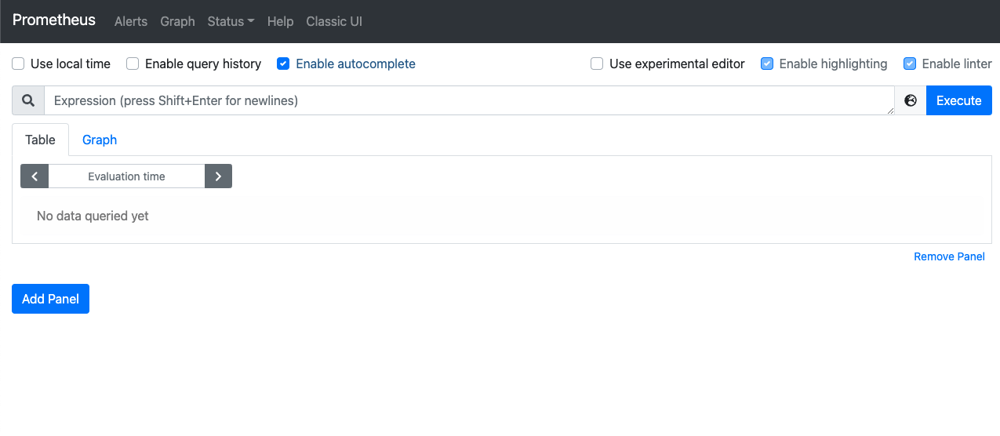
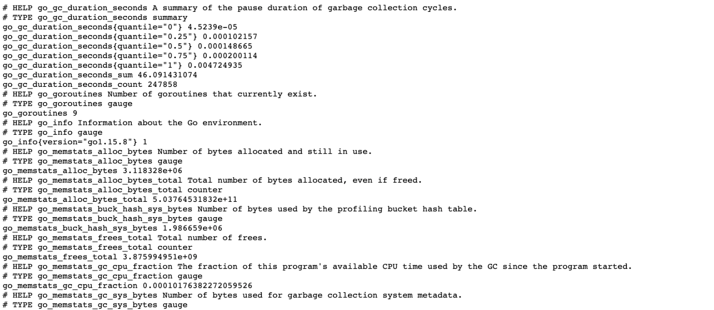
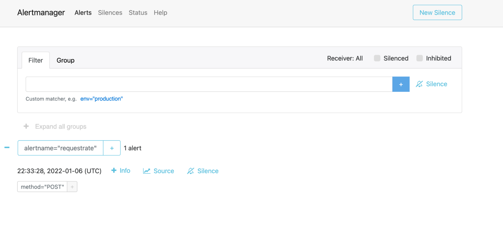
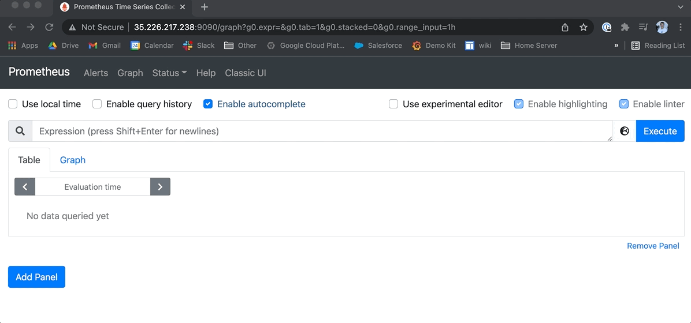
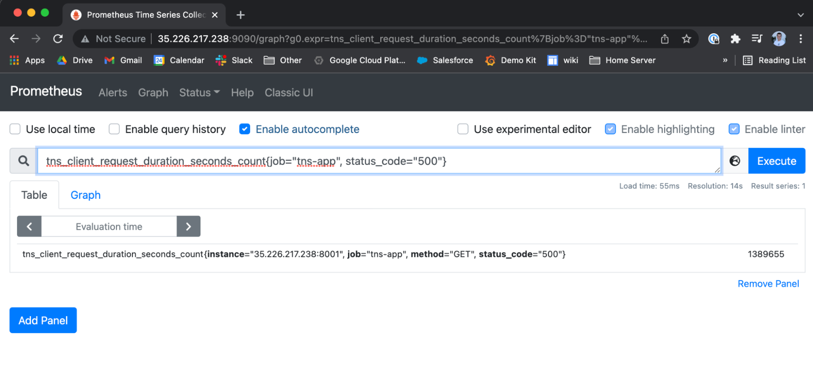
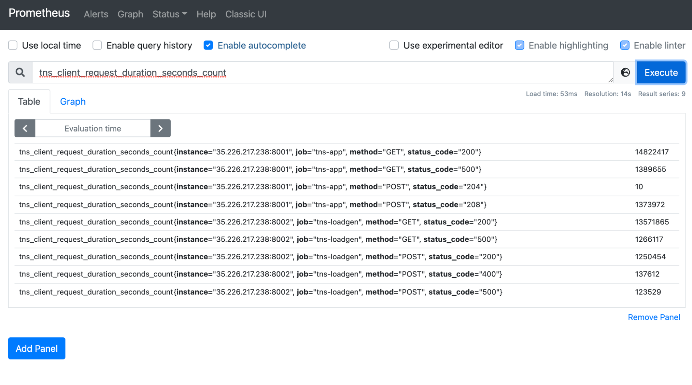
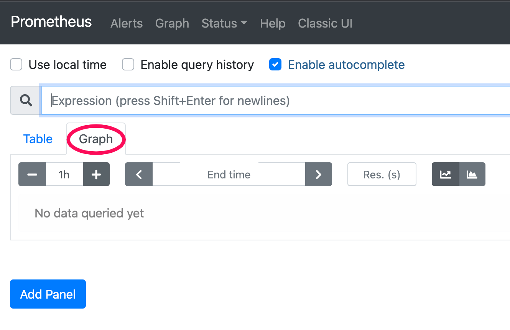
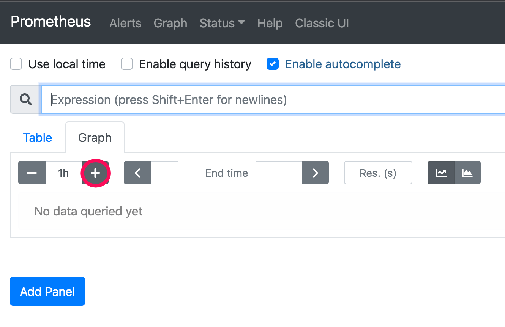

# Prometheus Breakout 1 - Exploring the UI

## Getting Started
**Prometheus Server endpoint:** [http://35.226.217.238:9090](http://35.226.217.238:9090)

Connect to this URL in your web browser.  You'll be presented with the Prometheus UI which contains five tabs across the top:

```bash
Alerts  Graph  Status  Help  ClassicUI
```




* By default, you'll see the **Graph** tab which contains a query box.
* Go to the **Alerts** tab where you will see we have configured a few alerts. Take a look at the ones listed - does anything stand out?
* Go to the **Status** tab. This contains a sub menu you can poke around in.
  * The first one I would visit is the **Targets** page; this tells us what's been configured in the Prometheus server. These jobs are what we defined in the prometheus server yml config. They will either be up or down.
  * Review **Runtime & Build Information**.
  * *The **Configuration** page will present a similar configuration we just went over, with a bit more targets added.*

## Node Exporter
[Node exporter](https://github.com/prometheus/node_exporter) is running on the endpoint below and we can check the metrics by visiting its /metrics endpoint.

For this step, just click on the link and take a look at what this looks like so you can become familiar with the tool that is providing the raw statistics for Prometheus.

[http://35.226.217.238:9100/metrics](http://35.226.217.238:9100/metrics)



## Alertmanager UI
[http://35.226.217.238:9093](http://35.226.217.238:9093)

Click this URL and take a look at the [Alertmanager UI](https://github.com/prometheus/alertmanager). The Alertmanager handles alerts sent by the Prometheus server. It takes care of deduplicating, grouping, and routing them to the correct receiver integration such as email, PagerDuty, or OpsGenie.

For this step, just click on the link and take a look at what this looks like so you're familiar with it. You don't need to do anything in the Alertmanager right now and you'll see it later in the workshop.



## Querying
Let's go back to the Prometheus server [webpage](http://35.226.217.238:9090) to graph a few queries using the Prometheus query language, [PromQL](https://prometheus.io/docs/prometheus/latest/querying/basics/).

You can use the drop-down field next to the **Execute** button (*insert metric at cursor*) to start finding metrics to visualize. Or, simply begin typing a metric name and find your metric name using the autofill feature:



Let’s take a look at the `up` metric. Type it into the query box and click **Execute**.

The `up` metric is probably the most popular query to run. It gives you a value of 1 (up) or 0 (down) and lets you know which jobs are running. Besides using the [targets](http://35.226.217.238:9090/targets) page under the **Status** tab in the Prometheus UI, this is the quickest way to know what is up. Feel free to try typing other statistics to see how the query box works.

In preparation for your second breakout, you will be using metric names that start with `tns_`. Take a look at a few examples.

```
tns_client_request_duration_seconds_count{job="tns-app", status_code="500"}
```

This metric pulls the client request duration, and it uses labels in the curly braces to filter it for the job called `tns-app` with a `status_code` with a value of `500`. Take a look at the **Graph** tab - do you notice anything interesting?



Go back to the **Table** view and try removing the labels by removing the curly braces and everything inside it that is filtering the results. What do you see?



Now, take a look at some node exporter specific metrics:

```
node_cpu_seconds_total
```

This metric tells you how many seconds each CPU spent doing each type of work (such as `mode="idle"`, time when the CPU had nothing to do).

Now try switching from the **Table** output to **Graph** visualization by clicking on the **Graph** tab to get a feel for the Prometheus graphing capabilities.



Zoom out the graph by clicking the `+` sign next to the time marker (which defaults to 1h) to add more time to the Graph. Switch back and forth between the two as you try the queries below.



We have not discussed counters and query functions yet, but to give you a quick example, we are taking a counter and calculating the per second values using the `irate` function.

```
rate(node_network_receive_bytes_total[1m])
```

This tells us each network device's statistics for received bytes. This is also a counter type of metric.

The metric `node_network_receive_bytes_total` is a counter type of metric. A counter metric is a cumulative number that is always going up. For this example, the number of bytes received is always increasing. The `rate` function calculates the rate of increase of this metric per second. Lastly the `[1m]` is the range selector for the query, determining the window in which to average the values across (ie. take all the values over the last minute for this per-second value). This helps us specify how far back values should be fetched for each resulting data point.

```
count by(mode) (node_cpu_seconds_total)
```

We will go more into PromQL in the next section, but as a preview, if you break down this query, it is counting the number of elements in this vector broken down by mode.


Count Count

Since we aren't visualizing metrics in Grafana yet (and therefore, aren’t able to set a value unit such as percentage), let’s see what the total CPU usage is in terms of percentage:

```
100 - (avg by (instance)(irate(node_cpu_seconds_total{job="node",mode="idle"}[5m])) * 100)
```

Challenge: What do you think this query is telling us?

```
1 - (node_filesystem_free_bytes{fstype=~"ext4|xfs"} / node_filesystem_size_bytes{fstype=~"ext4|xfs"})
```

## Pop Quiz
What query would you use to find the Prometheus build info?

How many time series does this Prometheus server have?

## End of first breakout. Stop here!

---
```


```
## Answer to the Pop Quiz
```
prometheus_build_info
```

`prometheus_tsdb_head_series` to find `3100`
