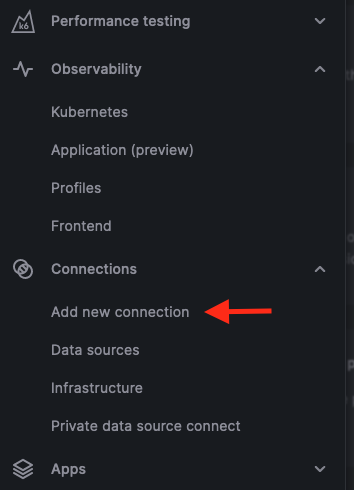
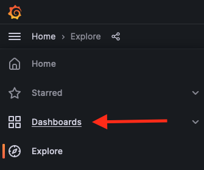
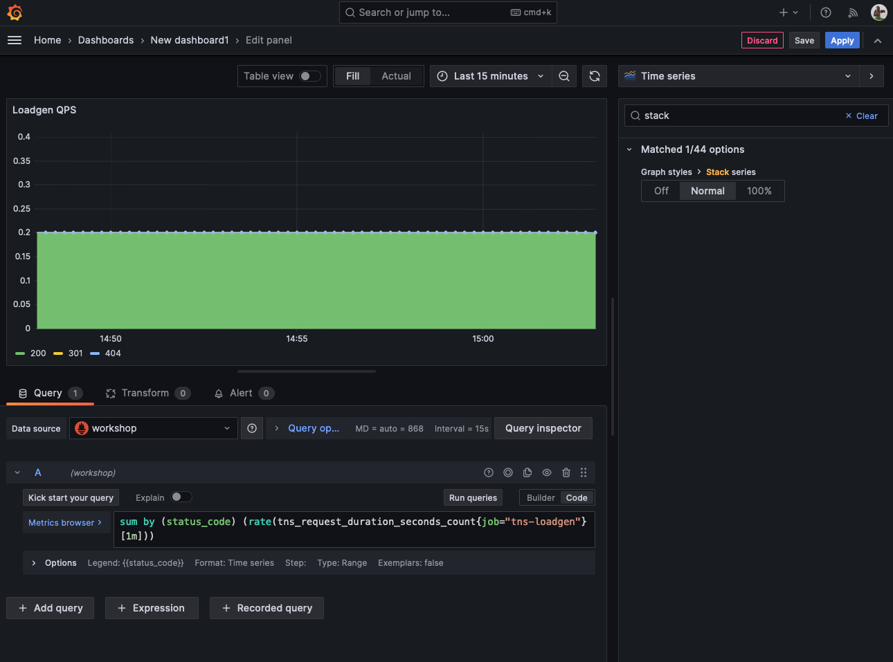
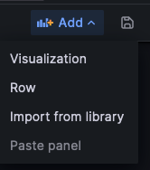
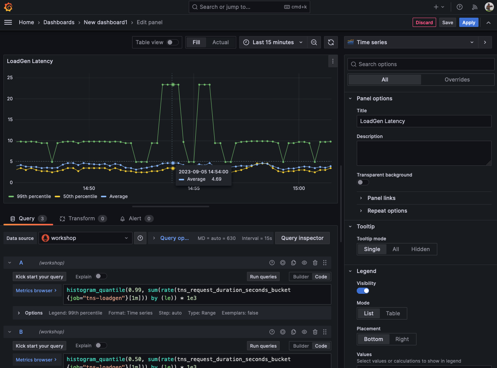
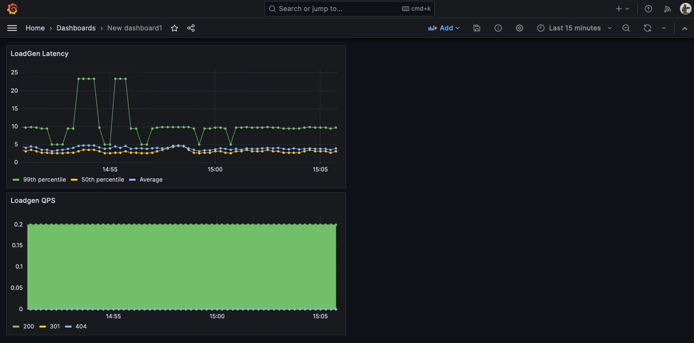

# Prometheus Breakout 2 - PromQL and Dashboarding in Grafana

Visit grafana.com and sign in to access your hosted Grafana instance or log in to your hosted Grafana instance directly (https://YourInstanceExampleURL.grafana.net).

Once logged into grafana.com, you'll be presented with your stack. Click the Log in button in the Grafana section:


## Adding a Prometheus Data Source
Once you are signed into your instance, let's visit the data source section and add one.

On the left hand side, at the bottom of the menu bar, go to the settings gear -> **Data Sources**.



In the search toolbar, enter `Prometheus`, and then select `Prometheus data source` from the `Data source` section. In the next panel, select `Add new data source` in the top right of the page.

Name the data source `workshop`.

For the URL input, use [http://34.121.40.211:9090/](http://34.121.40.211:9090/)

Click **Save & Test** at the bottom of the page to confirm your Prometheus data source was added correctly.

Great! We’ve just added the Prometheus data source that we used in the first breakout session.

Grafana’s dashboard UI is all about building dashboards for visualization while the **Explore** view strips away all the dashboard and panel options so you can focus on the query.

---


Dashboard view

---


Explore view

---

In this workshop, we will apply the things we learned by writing a query first to get some data back. Once we have established our query, we can create a dashboard with visualization panels and saved queries.

## Using the Explore View
To write a query in the Explore view, click on the **Explore** icon in the navbar on the left.

Now that we are in the Explore view, make sure the `workshop` data source is selected on the top left.


First, use the drop-down to explore some of the metrics available to us. Looks familiar, right?


The query we want to start off with is `tns_request_duration_seconds_count`. Enter this into the metrics browser field and `Run query` in the top right of the Explorer page.

*Tip: Instead of clicking the **Run Query** button, you can use the shortcut `shift + enter | ctrl + enter`.*

This query is telling us the count of the number of requests. It will list all jobs.

Let’s focus on a specific job, `tns-app`.

Apply the job label:
```
{job="tns-app"}
```
to the end of the metric name (ie `tns_request_duration_seconds_count{job="tns-app"}`), and `Run query` again.

We can see the instance and job names are the same but we have a few different methods and status codes.

Let's turn this raw counter data into something useful. If you remember, counters are ever increasing unless reset.

Before we add the `rate()` query function, let’s use the time picker to go back a few days to see how the time series is ever increasing. Change the time range to 'Last 7 days' using the time range selector on the top-right of the Explore view. Look at how the graph continually increases in value over time.

Time to add the `rate()` query function!

```
rate(tns_request_duration_seconds_count{job="tns-app"})
```

Oh no! Error. We forgot the time window. Let’s try one minute:
```
rate(tns_request_duration_seconds_count{job="tns-app"}[1m])
```

There we go - now we are seeing something!

***Note: When choosing the time value for rate, the time frame must be at least 4 times your scrape interval.** In our example, we are scraping every 15 seconds so 1 minute is fine. But if we were scraping our targets every 30 seconds, we would want to make it at a minimum time frame of 2 minutes. You need at least 2 points to find the rate, but because scrapes could be missed, a safer bet is 4 points.

## Queries in Practice

Let's do a quick aggregation. Because the `sum` query function only takes instant vectors and outputs instant vectors, the `rate` query function is nested inside the `sum` to turn the range vector into an instant vector for the `sum` aggregation.

```
sum(rate(tns_request_duration_seconds_count{job="tns-app"}[1m]))
```

Doing a quick aggregation, we can see there are about 11 to 12 queries/requests per second.

This is the request rate to this service. But what is more valuable for us is to know how many things are *failing*. So instead of all status codes, I want to filter out status codes that are not `2xx`.

```
sum(rate(tns_request_duration_seconds_count{job="tns-app", status_code!~"2.."}[5m]))
```

Here, we are adding the label `status_code` with the label matching operator that selects labels that do not match the regular expression `2..` (`2` followed by any two characters).

You should see some failures now!

Following Google’s SRE principles, we know that failure rates are not that useful or interesting. We want to know about the portion of total traffic that is failing.

So let's divide the rate of failed requests by the rate of total requests:

```
sum(rate(tns_request_duration_seconds_count{job="tns-app", status_code!~"2.."}[5m])) /
sum(rate(tns_request_duration_seconds_count{job="tns-app"}[5m]))
```

And let's change the rate from 5 minutes to 1 hour and add a multiplier so it's easier to read:

```
100 * sum(rate(tns_request_duration_seconds_count{job="tns-app", status_code!~"2.."}[1h])) /
sum(rate(tns_request_duration_seconds_count{job="tns-app"}[1h]))
```

Now, we begin to see something interesting. We can see that over the last hour, 16% of my requests are failing:


Taking a pause here to recap, what we have done is taken some raw counters and made it a more interesting query that can tell us what is failing.

To find which request method is failing, we can use a query like this:

```
sum by (method) (rate(tns_request_duration_seconds_count{job="tns-app", status_code!~"2.."}[1h])) /
sum by (method) (rate(tns_request_duration_seconds_count{job="tns-app"}[1h]))
```

*A PromQL gotcha is if you specify which label you care about in your query (by adding `by (<label>)` to either the numerator or denominator), you need to add the same to the other half of the fraction.*

It is recommended to always sum error rates by method so you can distinguish which route(s) is failing.

## Building a RED Dashboard

* Rate (the number of requests per second)
* Errors (the number of those requests that are failing)
* Duration (the amount of time those requests take)

We are going to build a dashboard with six panels:


The dashboard is broken down by **Load balancer**, **App**, and **Database**.

To add a new dashboard, click on the **+** icon on the left hand side of the Grafana UI and click on **Dashboard**.



Now use the `New dashboard` option after selecting `New` from the right hand side of the page.


To add your first panel, click on the **Add visualization** box:


Now select your `workshop` data source to run the query against.

For your query, input this query in the PromQL input field:
```
sum by (status_code) (rate(tns_request_duration_seconds_count{job="tns-loadgen"}[1m]))
```

Add a relevant legend; select `Options` underneath the query, and then select `Custom`, finally input `{{status_code}}`.

Change the name of the visualization panel by moving to the right hand menu bar and changing `Panel Title` to `LoadGen QPS`.

Search for `fill opacity` using the search field in the right hand menu bar, then change the value of `Graph styles > Fill opacity` from `0` to `100`.

Finally search for `Stack series` and change the stack from `Off` to `Normal`.



Click **Apply**.

Now change the time range from `Last 6 hours` to `Last 15 minutes` by using the time range picker in the top right (the clock icon).

Add another panel by clicking the **Add** button:



Then click the **Visualization** button.

We will be using these three queries:
```
histogram_quantile(0.99, sum(rate(tns_request_duration_seconds_bucket{job="tns-loadgen"}[1m])) by (le)) * 1e3
```
**Legend**: 99th Percentile

Click the **+ Query** button to add query B:


```
histogram_quantile(0.50, sum(rate(tns_request_duration_seconds_bucket{job="tns-loadgen"}[1m])) by (le)) * 1e3
```
**Legend**: 50th Percentile

Add another query:

```
(sum(rate(tns_request_duration_seconds_sum{job="tns-loadgen"}[1m])) / sum(rate(tns_request_duration_seconds_count{job="tns-loadgen"}[1m]))) * 1e3
```
**Legend**: Average

Name the panel **LoadGen Latency.**

And hit **Apply** on the top right:



Now move the dashboard to the right using the drag and drop function.



Save the dashboard and title it **TNS Workshop**.

You should now have a row of two panels. Next, create four more new panels following the same steps but change the job names to `tns-app` for the second row and `tns-db` for the last row.

You can do this by adding individual panels, but it's better to duplicate the left panel twice and the right panel twice to end up with this:


To duplicate click the panel title **-> More -> Duplicate**.

Once you have those panels, edit the middle two panels and change the job label to `tns-app`. Edit the bottom two panels and change the job label to `tns-db`.

When you are done, you will have created a useful SRE dashboard giving you valuable insights into your service.

## End of second breakout. Stop here!

## References:

Here is the completed JSON of the dashboard you can upload in the future: [https://grafana.com/grafana/dashboards/13017](https://grafana.com/grafana/dashboards/13017)

* [Cardinality is key](https://www.robustperception.io/cardinality-is-key)
* [SLO alerting recap](https://grafana.com/blog/2019/11/27/kubecon--recap-how-to-include-latency-in-slo-based-alerting/)
* [Google SRE Book](https://landing.google.com/sre/sre-book/toc/index.html)
* [Better histograms](https://grafana.com/blog/2020/08/24/kubecon-cloudnativecon-eu-recap-better-histograms-for-prometheus/)
* [Introduction to PromQL](https://grafana.com/blog/2020/02/04/introduction-to-promql-the-prometheus-query-language/)
* [PromQL for Mere Mortals](https://www.youtube.com/watch?v=hTjHuoWxsks)
* [USE Method](https://grafana.com/blog/2018/08/02/the-red-method-how-to-instrument-your-services/)
* [Alerting in the Prometheus Universe](https://www.youtube.com/watch?v=yrK6z3fpu1E)
* [Predict Linear Query Function](https://www.robustperception.io/reduce-noise-from-disk-space-alerts)


